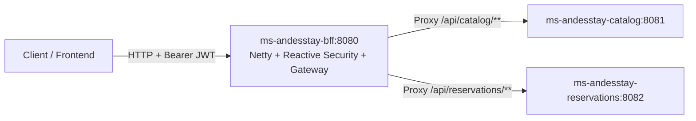

# Requirements

### Overview & Goals
The console logs indicate that `ms-andesstay-bff` starts up an embedded Apache Tomcat servlet container (`o.s.b.w.embedded.tomcat.TomcatWebServer : Tomcat initialized with port(s): 8080`, `ServletWebServerApplicationContext`).

**Root Cause:**
Spring Cloud Gateway (`spring-cloud-starter-gateway`) is built on Project Reactor and Spring WebFlux (running on Netty). In `ms-andesstay-bff/pom.xml`, `spring-boot-starter-web` (Spring MVC / Tomcat) is included. When `spring-boot-starter-web` is present on the classpath, Spring Boot boots a Servlet container (Tomcat) rather than a reactive server (Netty). This causes Spring Cloud Gateway routes to not function properly and conflicts with reactive components. Furthermore, `SecurityConfig.java` is configured with Servlet-based Spring Security (`HttpSecurity`, `SecurityFilterChain`) rather than reactive WebFlux security (`ServerHttpSecurity`, `SecurityWebFilterChain`).

**Goal:**
Resolve the runtime conflict by migrating `ms-andesstay-bff` completely to the reactive Spring WebFlux stack, enabling Spring Cloud Gateway routing and reactive OAuth2 resource server validation.

### Scope
- **In Scope:**
  - Remove `spring-boot-starter-web` from `ms-andesstay-bff/pom.xml`.
  - Migrate `SecurityConfig.java` to use Spring Security Reactive (`@EnableWebFluxSecurity`, `ServerHttpSecurity`, `SecurityWebFilterChain`).
  - Validate that `MsAndesstayBffApplication` boots with the reactive Netty server and loads gateway routes.
- **Out of Scope:**
  - Modifying backend microservices (`ms-andesstay-catalog`, `ms-andesstay-reservations`, etc.).
  - Changing routing endpoints or Azure AD tenant settings in `application.properties`.

### User Stories
- As a **developer / system**, I want `ms-andesstay-bff` to initialize a reactive Netty server so that Spring Cloud Gateway can route incoming API traffic to downstream microservices.
- As a **client**, I want my JWT token validated at the BFF gateway layer before requests are proxied to catalog and reservation services.

### Functional Requirements
1. `ms-andesstay-bff` must boot with Netty as the embedded reactive server instead of Apache Tomcat.
2. Spring Cloud Gateway routing for `/api/catalog/**` (to `localhost:8081`) and `/api/reservations/**` (to `localhost:8082`) must be handled by the reactive gateway engine.
3. Unauthenticated requests to protected routes must be rejected with 401 Unauthorized by the reactive OAuth2 Resource Server filter chain.
4. Public access to `/actuator/health` must be allowed without authentication.

### Non-Functional Requirements
- Maintain compatibility with Spring Boot 3.1.5 and Spring Cloud 2022.0.4.
- Zero breaking changes to `application.properties` route configurations and JWT issuer configuration.

# Technical Design

### Current Implementation
- `ms-andesstay-bff/pom.xml` contains both `spring-boot-starter-web` (servlet) and `spring-cloud-starter-gateway` (reactive).
- `ms-andesstay-bff/src/main/java/com/duoc/msandesstaybff/security/SecurityConfig.java` uses `org.springframework.security.config.annotation.web.builders.HttpSecurity` and `org.springframework.security.web.SecurityFilterChain`, which require a servlet environment.
- At runtime, Spring Boot prioritizes Tomcat over Netty, causing Spring Cloud Gateway routing not to work.

### Key Decisions
- **Remove `spring-boot-starter-web`**: Spring Cloud Gateway already includes `spring-boot-starter-webflux` transitively. Removing the servlet dependency allows Spring Boot to auto-configure Reactor Netty.
- **Adopt `ServerHttpSecurity` in `SecurityConfig`**: Use reactive Spring Security for WebFlux to validate Azure AD JWTs across gateway routes without blocking.

### Architecture Diagram


### Proposed Changes

#### 1. `ms-andesstay-bff/pom.xml`
Remove:
```xml
<dependency>
    <groupId>org.springframework.boot</groupId>
    <artifactId>spring-boot-starter-web</artifactId>
</dependency>
```

#### 2. `ms-andesstay-bff/src/main/java/com/duoc/msandesstaybff/security/SecurityConfig.java`
Update to reactive security:
```java
package com.duoc.msandesstaybff.security;

import org.springframework.context.annotation.Bean;
import org.springframework.context.annotation.Configuration;
import org.springframework.security.config.Customizer;
import org.springframework.security.config.annotation.web.reactive.EnableWebFluxSecurity;
import org.springframework.security.config.web.server.ServerHttpSecurity;
import org.springframework.security.web.server.SecurityWebFilterChain;

@Configuration
@EnableWebFluxSecurity
public class SecurityConfig {

    @Bean
    public SecurityWebFilterChain securityWebFilterChain(ServerHttpSecurity http) {
        return http
                .csrf(ServerHttpSecurity.CsrfSpec::disable)
                .authorizeExchange(exchanges -> exchanges
                        .pathMatchers("/actuator/health").permitAll()
                        .anyExchange().authenticated()
                )
                .oauth2ResourceServer(oauth2 -> oauth2
                        .jwt(Customizer.withDefaults())
                )
                .build();
    }
}
```

### File Structure Changes
- `ms-andesstay-bff/pom.xml` (modified)
- `ms-andesstay-bff/src/main/java/com/duoc/msandesstaybff/security/SecurityConfig.java` (modified)

### Risks & Mitigations
- **Risk:** Existing custom controllers (if any are added later) relying on `javax.servlet` or `jakarta.servlet` APIs will not work.
  - **Mitigation:** In a BFF Gateway architecture, endpoints should either be routed via Spring Cloud Gateway or written using WebFlux (`@RestController` returning `Mono`/`Flux`).

# Testing

### Validation Approach
- Verify that `mvn clean test-compile` and unit tests in `ms-andesstay-bff` pass.
- Verify that during startup, the application logs show `Netty started on port(s) 8080` instead of `Tomcat initialized with port(s): 8080`.

### Key Scenarios
1. **Application Startup on Netty**: Ensure Spring Boot initializes `ReactiveWebServerApplicationContext` with Netty on port 8080.
2. **Health Check Endpoint**: Verify `/actuator/health` is reachable without JWT authentication.
3. **Secured Gateway Route Access**:
   - Request to `/api/catalog/**` without Authorization header returns `401 Unauthorized`.
   - Request to `/api/catalog/**` with valid Azure AD Bearer token routes to `http://localhost:8081`.

# Delivery Steps

### ✓ Step 1: Remove Servlet dependency from ms-andesstay-bff pom.xml
The BFF module dependencies will exclude Spring MVC / Tomcat, enabling Spring Cloud Gateway's reactive Netty runtime.

- Edit `ms-andesstay-bff/pom.xml` to remove the `spring-boot-starter-web` dependency.
- Ensure `spring-cloud-starter-gateway` and `spring-boot-starter-oauth2-resource-server` manage the reactive WebFlux runtime without classpath collisions.

### ✓ Step 2: Migrate SecurityConfig to Reactive Spring Security
The security configuration will align with Spring WebFlux and Spring Cloud Gateway reactive filters.

- Update `ms-andesstay-bff/src/main/java/com/duoc/msandesstaybff/security/SecurityConfig.java`:
  - Replace `@EnableWebSecurity` with `@EnableWebFluxSecurity`.
  - Replace `HttpSecurity` and `SecurityFilterChain` with `ServerHttpSecurity` and `SecurityWebFilterChain`.
  - Update CSRF handling using `ServerHttpSecurity.CsrfSpec::disable`.
  - Update URL matching using `authorizeExchange()` and `pathMatchers("/actuator/health")`.
  - Configure `oauth2ResourceServer` to use `.jwt(Customizer.withDefaults())`.
- Verify compilation and application context startup using `MsAndesstayBffApplicationTests`.